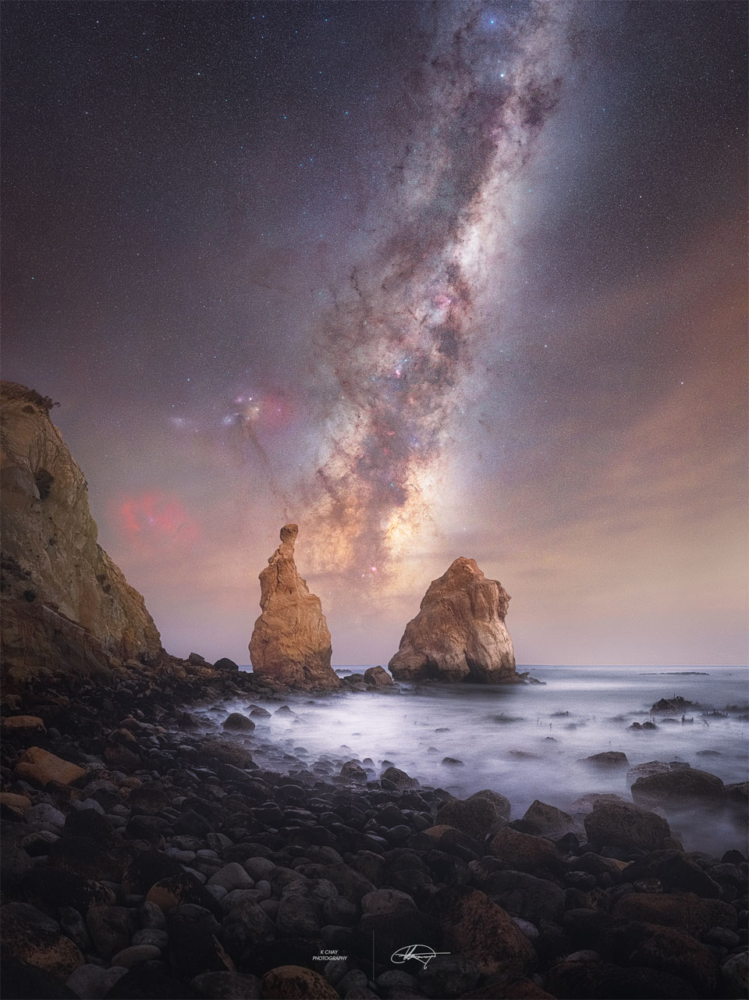

# Milky-Way-Through-Otago-Spires

**Date:** 02-07-25  
**Media Type:** `image`  

---

### Explanation

> Does the Milky Way always rise between these two rocks? No. Capturing this stunning alignment took careful planning: being in the right place at the right time. In the featured image taken in June 2024 from Otago, New Zealand, the bright central core of our Milky Way Galaxy, home to the many of our Galaxy's 400 billion stars, can be seen between two picturesque rocks spires.  For observers in Earth's Northern Hemisphere, the core is only visible throughout the summer. As Earth orbits the Sun, different parts of the Milky Way become visible at different angles at different times of the night. As Earth rotates, the orientation of the Milky Way in the sky also shifts -- sometimes standing vertically as seen in the featured image, and other times stretching parallel to the horizon, making it harder to see. In early June, observers can watch it emerge low on the horizon after sunset and gradually arc upward to reveal its full grandeur.

---

[View this on NASA APOD](https://apod.nasa.gov/apod/astropix.html)
