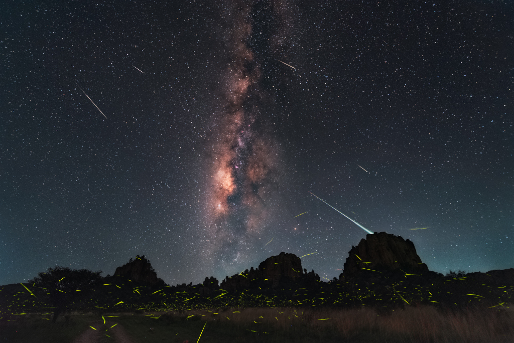

# Fireflies-Meteors-and-Milky-Way

**Date:** 02-08-25  
**Media Type:** `image`  

---

### Explanation

> Taken on July 29 and July 30, a registered and stacked series of exposures creates this dreamlike view of a northern summer night. Multiple firefly flashes streak across the foreground as the luminous Milky Way arcs above the horizon in the Sierra de Órganos national park of central Mexico, The collection of bright streaks aligned across the sky toward the upper left in the timelapse image are Delta Aquariid meteors. Currently active, the annual Delta Aquarid meteor shower shares August nights though, overlapping with the better-known Perseid meteor shower. This year that makes post-midnight, mostly moonless skies in early August very popular with late night skygazers. How can you tell a Delta Aquariid from a Perseid meteor?  The streaks of Perseid meteors can be traced back to an apparent radiant in the constellation Perseus. Delta Aquariids appear to emerge from the more southerly constellation Aquarius, beyond the top left of this frame. Of course, the bioluminescent flashes of fireflies are common too on these northern summer nights. But how can you tell a firefly from a meteor? Just try to catch one.

---

[View this on NASA APOD](https://apod.nasa.gov/apod/astropix.html)
