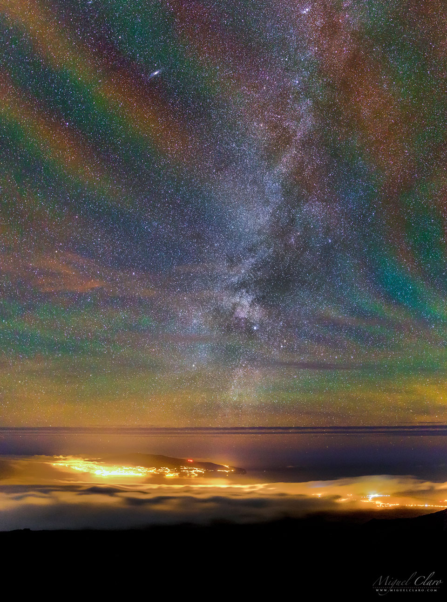

# Rainbow-Airglow-over-the-Azores

**Date:** 03-06-25  
**Media Type:** `image`  

---

### Explanation

> Why would the sky glow like a giant repeating rainbow?  Airglow.  Now, air glows all of the time, but it is usually hard to see. A disturbance however -- like an approaching storm -- may cause noticeable rippling in the Earth's atmosphere. These gravity waves are oscillations in air analogous to those created when a rock is thrown in calm water.  The long-duration exposure nearly along the vertical walls of airglow likely made the undulating structure particularly visible.  OK, but where do the colors originate?  The deep red glow likely originates from OH molecules about 87 kilometers high, excited by ultraviolet light from the Sun. The orange and green airglow is likely caused by sodium and oxygen atoms slightly higher up.  The featured image was captured during a climb up Mount Pico in the Azores of Portugal.  Ground lights originate from the island of Faial in the Atlantic Ocean.  A spectacular sky is visible through this banded airglow, with the central band of our Milky Way Galaxy running up the image center, and M31, the Andromeda Galaxy, visible near the top left.   APOD Turns 30!: Free Public Lecture in Anchorage on June 11

---

[View this on NASA APOD](https://apod.nasa.gov/apod/astropix.html)
