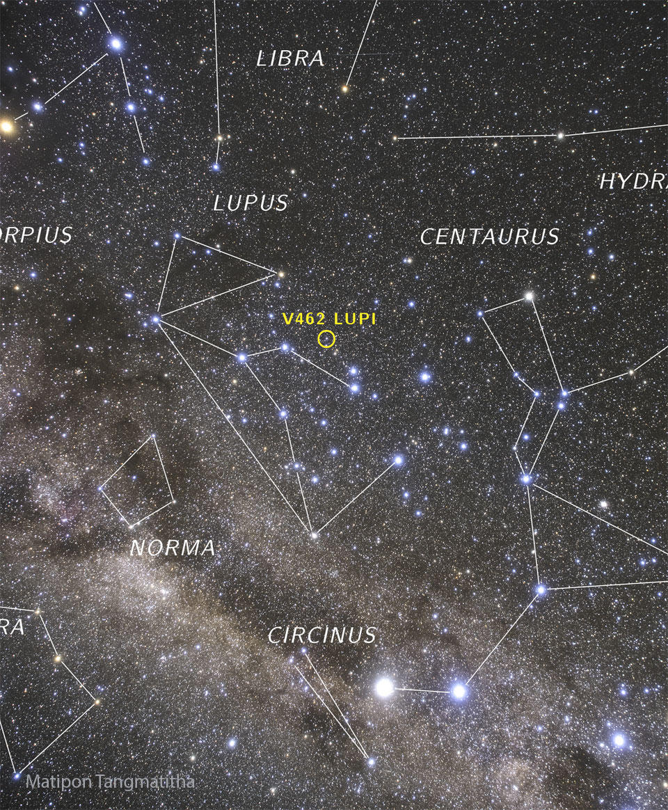

# Nova-V462-Lupi-Now-Visible

**Date:** 03-07-25  
**Media Type:** `image`  

---

### Explanation

> If you know where to look, you can see a thermonuclear explosion from a white dwarf star. Possibly two.  Such explosions are known as novas and the detonations are currently faintly visible with the unaided eye in Earth's southern hemisphere -- but are more easily seen with binoculars. Pictured, Nova Lupi 2025 (V462 Lupi) was captured toward the southern constellation of the Wolf (Lupus) last week near the central plane of our Milky Way galaxy.  Nova Lupi 2025 was originally discovered on June 12 and peaked in brightness about a week later. Similarly, Nova Velorum 2025, toward the southern constellation of the Ship Sails (Vela), was discovered on June 25 and peaked a few days later.  A nova somewhere in our Galaxy becomes briefly visible to the unaided eye only every year or two, so it is quite unusual to have two novas visible simultaneously.  Meanwhile, humanity awaits even a different nova: T Coronae Borealis, which should become visible in northern skies and is expected to become even brighter.

---

[View this on NASA APOD](https://apod.nasa.gov/apod/astropix.html)
