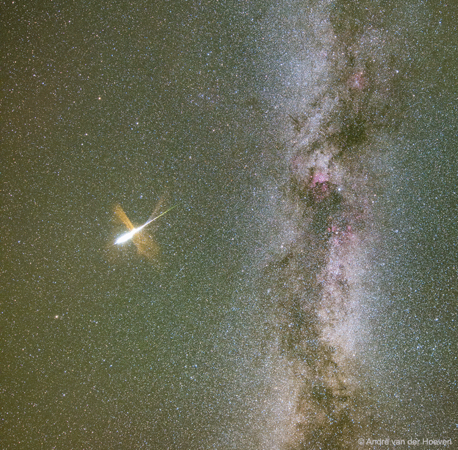

# Milky-Way-and-Exploding-Meteor

**Date:** 03-08-25  
**Media Type:** `image`  

---

### Explanation

> In about a week the Perseid Meteor Shower will reach its maximum.  Grains of icy rock will streak across the sky as they evaporate during entry into Earth's atmosphere.  These grains were shed from Comet Swift-Tuttle.  The Perseids result from the annual crossing of the Earth through Comet Swift-Tuttle's orbit, and are typically the most active meteor shower of the year.  Although it is hard to predict the level of activity in any meteor shower, in a clear dark sky an observer might see a meteor a minute.  This year's Perseids peak just a few days after  full moon, and so some faint meteors will be lost to the lunar skyglow.  Meteor showers in general are best seen from a relaxing position, away from lights.  Featured here is a meteor caught exploding during the 2015 Perseids above Austria next to the central band of our Milky Way Galaxy.

---

[View this on NASA APOD](https://apod.nasa.gov/apod/astropix.html)
