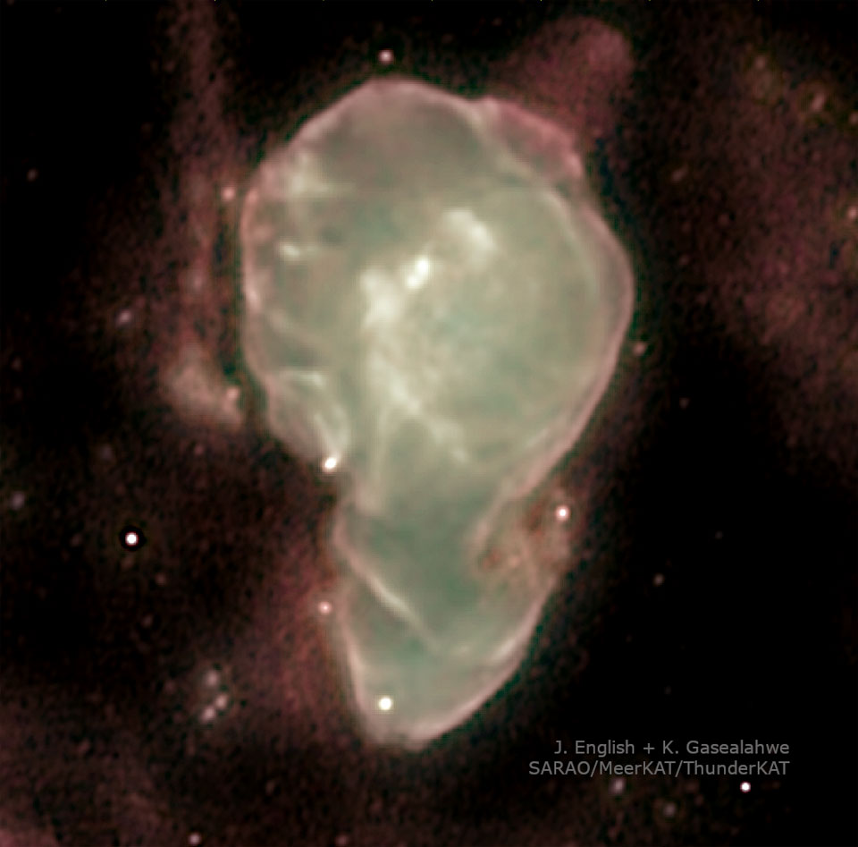

# Cir-X-1-Jets-in-the-Africa-Nebula

**Date:** 03-09-25  
**Media Type:** `image`  

---

### Explanation

> How soon do jets form when a supernova gives birth to a neutron star?  The Africa Nebula provides clues.  This supernova remnant surrounds Circinus X-1, an X-ray emitting neutron star and the companion star it orbits.  The image, from the ThunderKAT collaboration on the MeerKAT radio telescope situated in South Africa, shows the bright core-and-lobe structure of Cir X-1’s currently active jets inside the nebula.  A mere 4600 years old, Cir X-1 could be the "Little Sister" of microquasar SS 433*.  However, the newly discovered bubble exiting from a ring-like hole in the upper right of the nebula, along with a ring to the bottom left, demonstrate that other jets previously existed.  Computer simulations indicate those jets formed within 100 years of the explosion and lasted up to 1000 years.  Surprisingly, to create the observed bubble, the jets need to be more powerful than young neutron stars were previously thought to produce.   Open Science: Browse 3,700+ codes in the Astrophysics Source Code Library

---

[View this on NASA APOD](https://apod.nasa.gov/apod/astropix.html)
