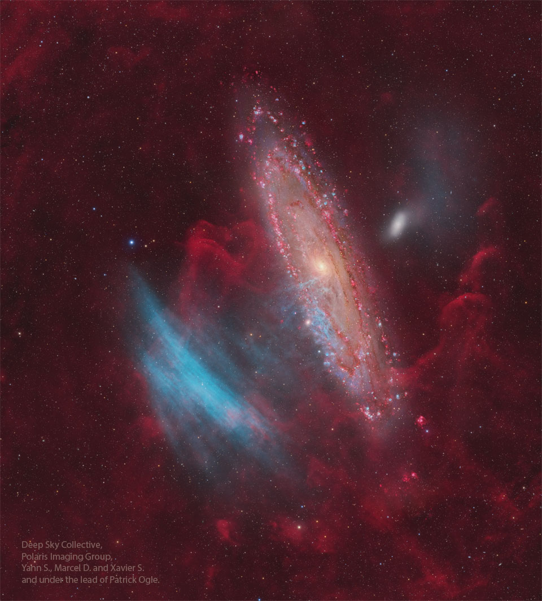

# Blue-Arcs-Toward-Andromeda

**Date:** 04-08-25  
**Media Type:** `image`  

---

### Explanation

> What are these gigantic blue arcs near the Andromeda Galaxy (M31)?  Discovered in 2022 by amateur astronomers, the faint arcs -- dubbed SDSO 1 -- span nearly the same angular size as M31 itself.  At first, their origin was a mystery: are they actually near the Andromeda Galaxy, or alternatively near to our Sun?  Now, over 550 hours of combined exposure and a collaboration between amateur and professional astronomers has revealed strong evidence for their true nature: SDSO 1 is not intergalactic, but a new class of planetary nebula within our galaxy.  Dubbed a Ghost Planetary Nebula (GPN), SDSO 1 is the first recognized member of a new subclass of faded planetary nebulas, along with seven others also recently identified.  Shown in blue are extremely faint oxygen emission from the shock waves, while the surrounding red is a hydrogen-emitting trail that indicates the GPN's age.

---

[View this on NASA APOD](https://apod.nasa.gov/apod/astropix.html)
