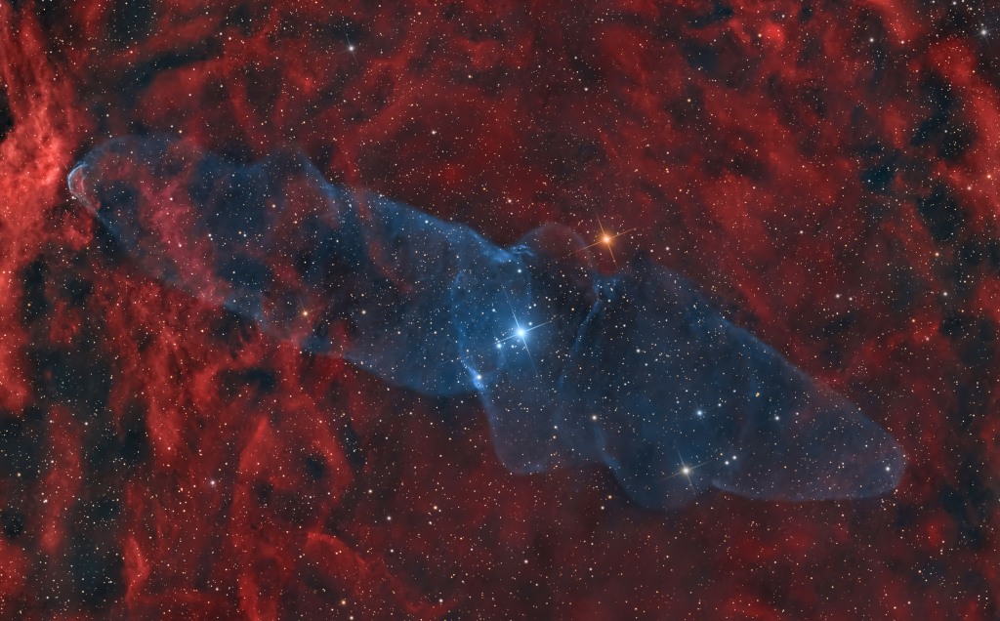

# Ou4-The-Giant-Squid-Nebula

**Date:** 05-07-25  
**Media Type:** `image`  

---

### Explanation

> Difficult to capture, this mysterious, squid-shaped interstellar cloud spans nearly three full moons in planet Earth's sky. Discovered in 2011 by French astro-imager Nicolas Outters, the Squid Nebula's bipolar shape is distinguished here by the telltale blue emission from doubly ionized oxygen atoms. Though apparently surrounded by the reddish hydrogen emission region Sh2-129, the true distance and nature of the Squid Nebula have been difficult to determine. Still, one investigation suggests Ou4 really does lie within Sh2-129 some 2,300 light-years away. Consistent with that scenario, the cosmic squid would represent a spectacular outflow of material driven by a triple system of hot, massive stars, cataloged as HR8119, seen near the center of the nebula. If so, this truly giant squid nebula would physically be over 50 light-years across.

---

[View this on NASA APOD](https://apod.nasa.gov/apod/astropix.html)
