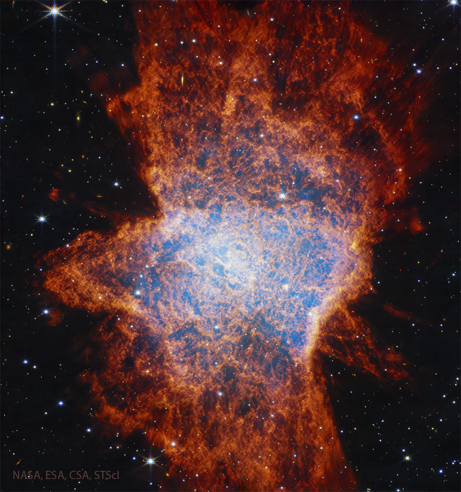

# NGC-6072-A-Complex-Planetary-Nebula-from-Webb

**Date:** 05-08-25  
**Media Type:** `image`  

---

### Explanation

> Why is this nebula so complex? The Webb Space Telescope has imaged a nebula in great detail that is thought to have emerged from a Sun-like star. NGC 6072 has been resolved into one of the more unusual and complex examples of planetary nebula. The featured image is in infrared light with the red color highlighting cool hydrogen gas. Study of previous images of NGC 6072 indicated several likely outflows and two disks inside the jumbled gas, while the new Webb image resolves new features likely including one disk's edge protruding on the central left.  A leading origin hypothesis holds that the nebula's complexity is caused or enhanced by multiple outbursts from a star in a multi-star system near the center.

---

[View this on NASA APOD](https://apod.nasa.gov/apod/astropix.html)
