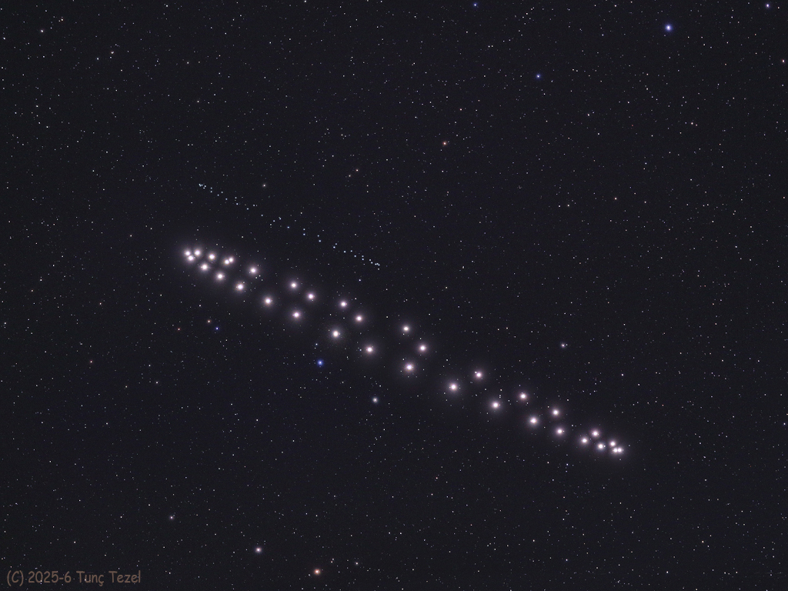

# The-Retrograde-Dance-of-Saturn-and-Neptune

**Date:** 06-05-26  
**Media Type:** `image`  

---

### Explanation

> What does it mean for Saturn and Neptune to be in retrograde? Featured is a composite of images taken over 34 nights from May 2025 to February 2026 tracing Saturn (brighter, foreground) and Neptune (dimmer, background). Over that time, the two planets exhibited retrograde motion, meaning they appeared to move backward in the sky. This apparent backwards motion occurs when Earth overtakes the slower outer planets as they orbit the Sun. Imagine the Solar System is a running track. Earth "runs" faster along the inside of the track compared to the outer planets. As Earth approaches, aligns, and then "laps" the outer planets, they change position from ahead to behind from the Earth's perspective. This perspective shift is what causes the outer planets to change position in the night sky. An animation corresponding to today’s image shows Saturn and Neptune’s months-long dance across the northern night sky. Saturn stepped from the Pisces constellation into Aquarius and back again while Neptune remained in Pisces. This is the closest Saturn and Neptune have been in the sky since their last conjunction in 1989.

---

[View this on NASA APOD](https://apod.nasa.gov/apod/astropix.html)
