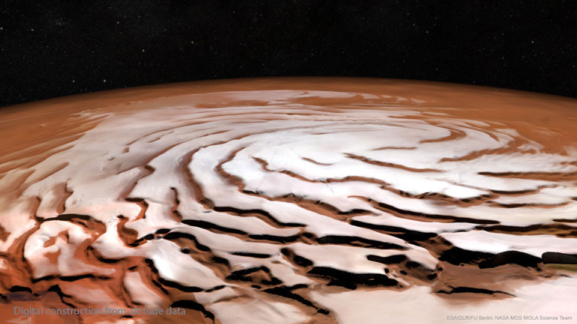

# The-Spiral-North-Pole-of-Mars

**Date:** 06-07-25  
**Media Type:** `image`  

---

### Explanation

> Why is there a spiral around the North Pole of Mars?  Each winter this pole develops a new outer layer about one meter thick composed of carbon dioxide frozen out of the thin Martian atmosphere.  This fresh layer is deposited on a water-ice layer that exists year round.  Strong winds blow down from above the cap's center and swirl due to the spin of the red planet -- contributing to Planum Boreum's spiral structure.  The featured image is a perspective mosaic generated in 2017 from numerous images taken by ESA's Mars Express and elevations extracted from the laser altimeter aboard NASA's Mars Global Surveyor mission.

---

[View this on NASA APOD](https://apod.nasa.gov/apod/astropix.html)
