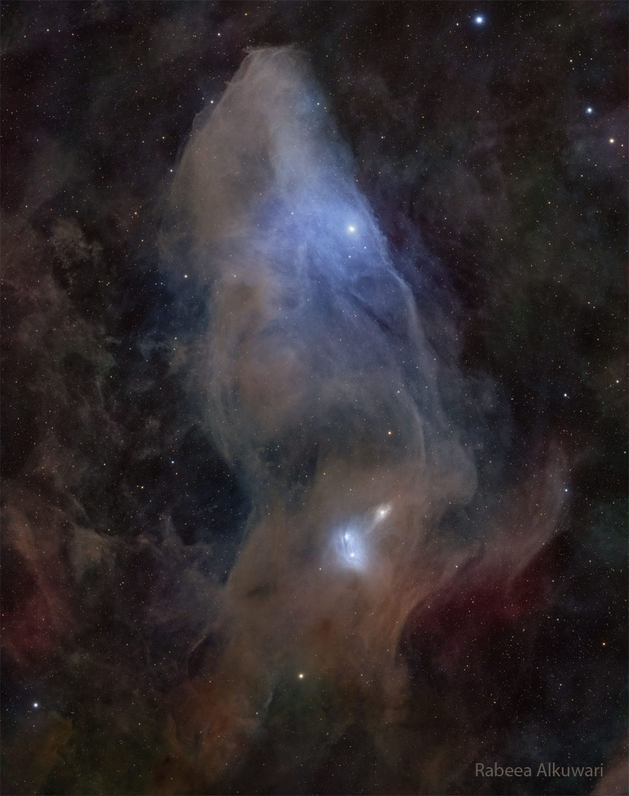

# IC-4592-The-Blue-Horsehead-Reflection-Nebula

**Date:** 07-04-26  
**Media Type:** `image`  

---

### Explanation

> Do you see the horse's head?   What you are seeing is not the famous Horsehead nebula toward Orion, but rather a fainter nebula that only takes on a familiar form with deeper imaging.  The main part of the here-imaged molecular cloud complex is  reflection nebula IC 4592.  Reflection nebulas are made up of very fine dust that normally appears dark but can look quite blue when reflecting the visible light of energetic nearby stars.  In this case, the source of much of the reflected light is a star at the eye of the horse.  That star is part of Nu Scorpii, one of the brighter star systems toward the constellation of the Scorpion (Scorpius).   A second reflection nebula dubbed IC 4601 is visible surrounding two stars just below the image center.  The featured picture was taken from  Sawda Natheel in  Qatar.   Jigsaw Nebula: Astronomy Puzzle of the Day

---

[View this on NASA APOD](https://apod.nasa.gov/apod/astropix.html)
