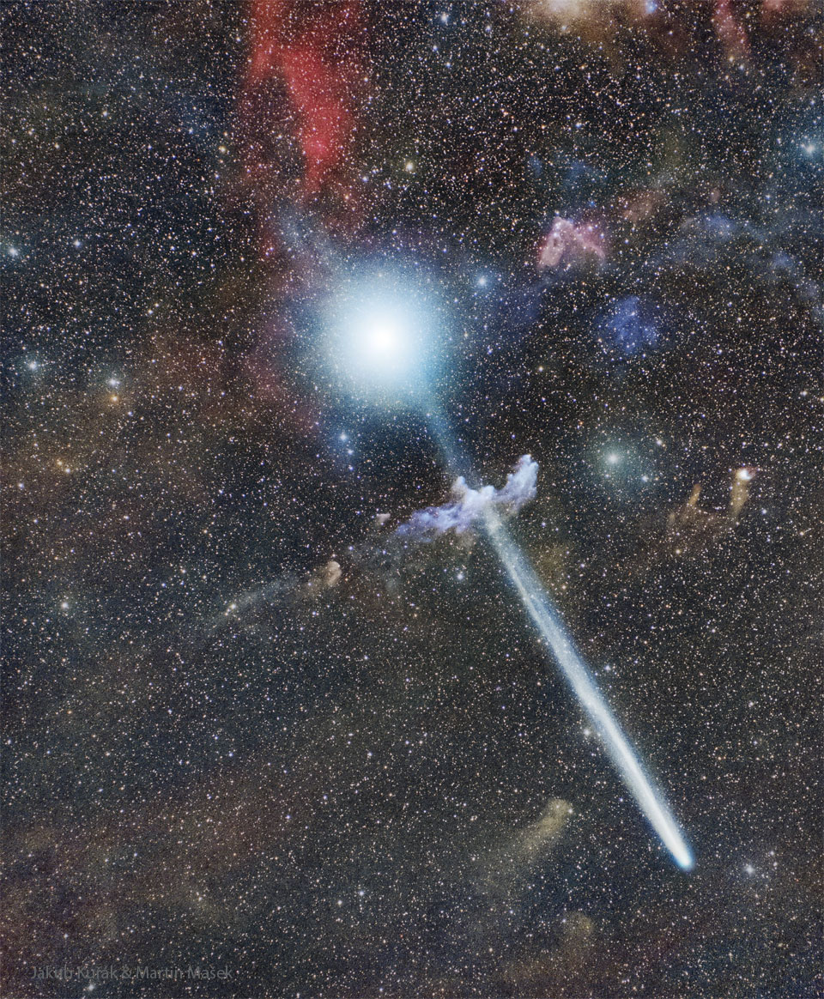

# Comet-R3-PanSTARRS-Before-Rigel

**Date:** 08-05-26  
**Media Type:** `image`  

---

### Explanation

> Which way is Comet R3 PanSTARRS going? Not towards the star at the top of the image, because that is Rigel, which, being far in the background, is unrelated to the comet. Not through the nebula in the image middle, because that is the Witch Head Nebula and it, too, is far in the distance -- but not far from Rigel.  Not into northern skies because over the past week Comet C/2025 R3 (PanSTARRS) has moved into southern skies and is now best visible in Earth's Southern Hemisphere toward the west after sunset.  Angularly, Comet R3 PanSTARRS is slowly moving toward the upper right, night by night, and will soon be in the constellation Orion. Spatially, the comet is now headed out of our Solar System but should remain visible to cameras in southern skies for about a week.  The featured image was captured last week near Cerro Paranal in Chile.   Growing Gallery: Comet R3 PanSTARRS in 2026

---

[View this on NASA APOD](https://apod.nasa.gov/apod/astropix.html)
