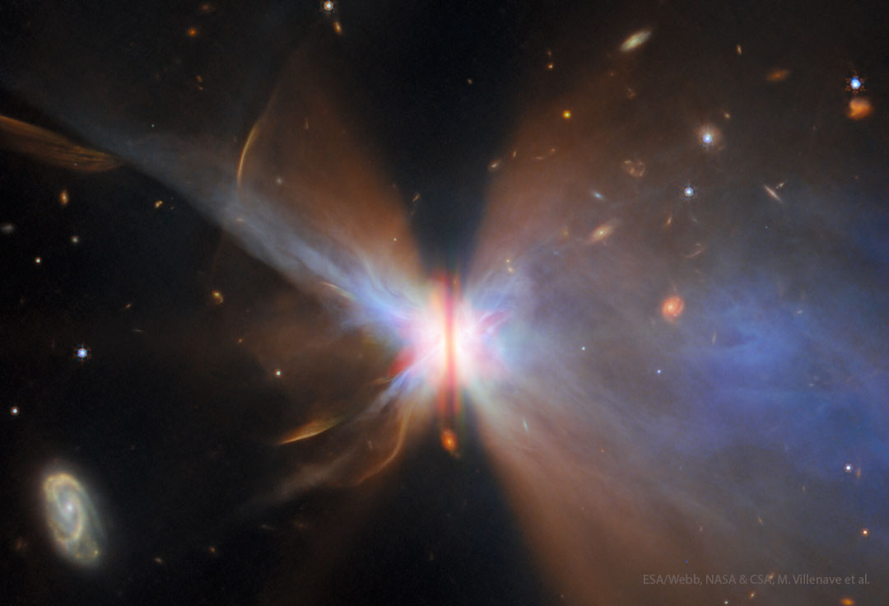

# IRAS-04302-Butterfly-Disk-Planet-Formation

**Date:** 08-09-25  
**Media Type:** `image`  

---

### Explanation

> This butterfly can hatch planets. The nebula fanning out from the star IRAS 04302+2247 may look like the wings of a butterfly, while the vertical brown stripe down the center may look like the butterfly's body -- but together they indicate an active planet-forming system. The featured picture was captured recently in infrared light by the Webb Space Telescope. Pictured, the vertical disk is thick with the gas and dust from which planets form. The disk shades visible and (most) infrared light from the central star, allowing a good view of the surrounding dust that reflects out light. In the next few million years, the dust disk will likely fragment into rings through the gravity of newly hatched planets.  And a billion years from now, the remaining gas and dust will likely dissipate, leaving mainly the planets -- like in our Solar System.    Explore the Universe: Random APOD Generator

---

[View this on NASA APOD](https://apod.nasa.gov/apod/astropix.html)
