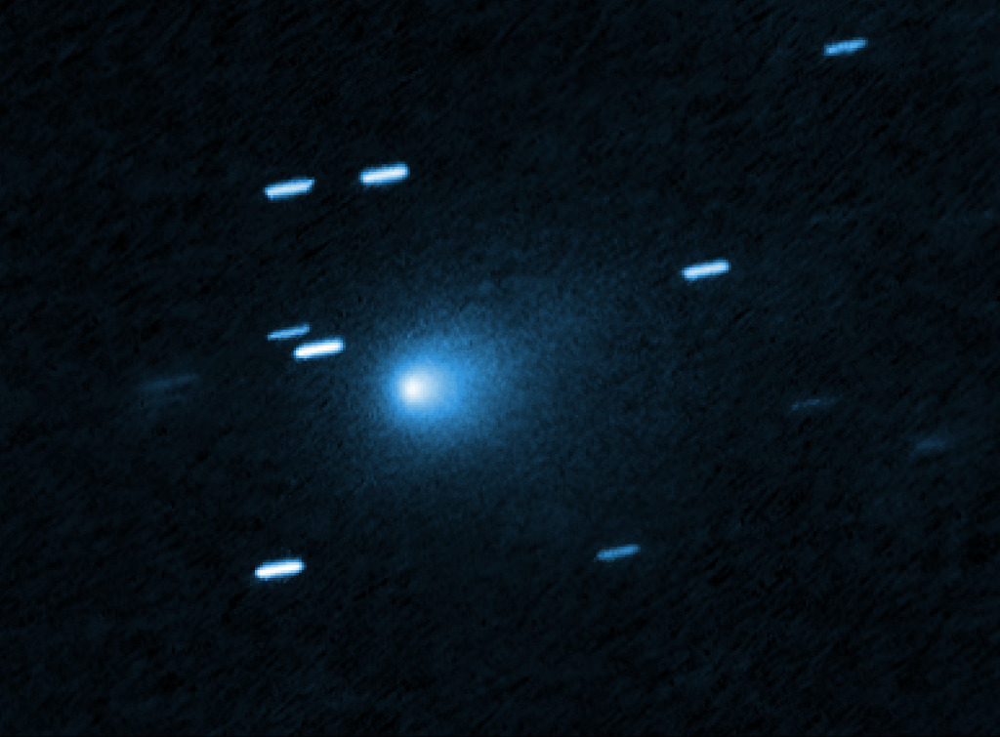

# Interstellar-Interloper-3IATLAS-from-Hubble

**Date:** 09-08-25  
**Media Type:** `image`  

---

### Explanation

> Discovered on July 1 with the NASA-funded ATLAS (Asteroid Terrestrial-impact Last Alert System) survey telescope in Rio Hurtado, Chile, 3I/ATLAS is so designated as the third known interstellar object to pass through our Solar System. It follows 1I/ʻOumuamua in 2017 and the comet 2I/Borisov in 2019.  Also known as C/2025 N1, 3I/ATLAS is a comet. A teardrop-shaped cloud of dust, ejected from its icy nucleus warmed by increasing sunlight, is seen in this sharp image from the Hubble Space Telescope captured on July 21. Background stars are streaked in the exposure as Hubble tracked the fastest comet ever recorded on its journey toward the inner solar system. An analysis of the Hubble image indicates the solid nucleus, hidden from direct view, is likely less that 5.6 kilometers in diameter. This comet's interstellar origin is clear from its orbit, determined to be an eccentric, highly hyperbolic orbit that does not loop back around the Sun and will return 3I/ATLAS to interstellar space. Not a threat to planet Earth, the inbound interstellar interloper is now within the Jupiter's orbital distance of the Sun, while its closest approach to the Sun will bring it just inside the orbital distance of Mars.

---

[View this on NASA APOD](https://apod.nasa.gov/apod/astropix.html)
