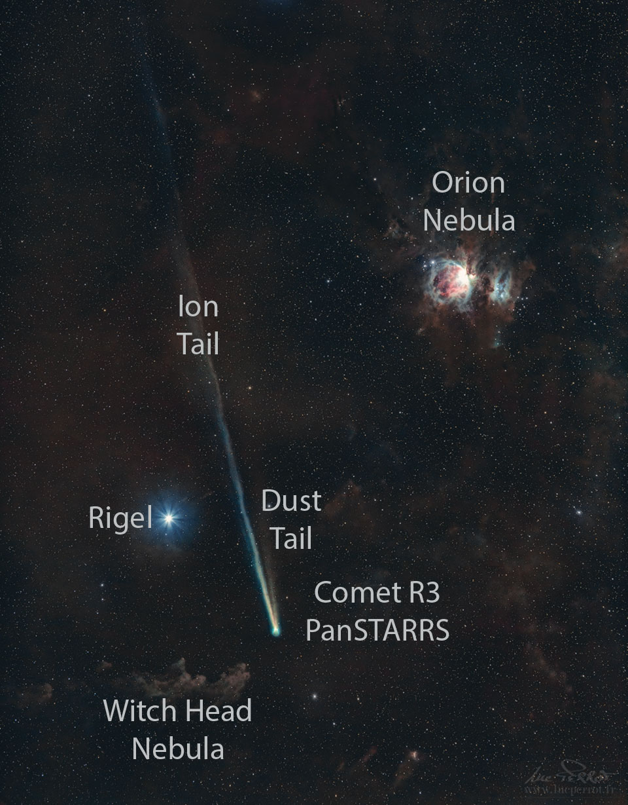

# Comet-R3-PanSTARRS-and-Orion

**Date:** 10-05-26  
**Media Type:** `image`  

---

### Explanation

> Orion never had a sword like this. As Comet C/2025 R3 (PanSTARRS) heads out of the inner Solar System, it is putting on quite a show for long exposure cameras.  Currently seen toward the constellation of Orion the Hunter, the distant Orion Nebula is visible on the upper right. Comet R3 PanSTARRS is now showing two distinct tails: a short dust tail pointing toward the top of the image and a long and wavy ion tail trailing off toward the upper left.  The ion tail points away from the Sun and glows blue from excited carbon monoxide.  Large particles in the dust tail somewhat resist the radiation pressure that push them away from the Sun and so retain a bit of the comet's orbit.  The dust tail shines by reflected sunlight. The featured image was taken a few days ago from France's Reunion Island in the southern Indian Ocean.   Growing Gallery: Comet R3 PanSTARRS in 2026

---

[View this on NASA APOD](https://apod.nasa.gov/apod/astropix.html)
