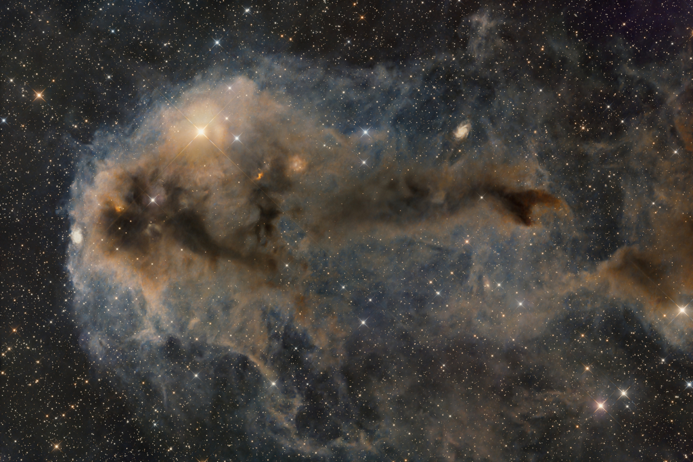

# Lynds-Dark-Nebula-1251

**Date:** 10-07-25  
**Media Type:** `image`  

---

### Explanation

> Stars are forming in Lynds Dark Nebula (LDN) 1251. About 1,000 light-years away and drifting above the plane of our Milky Way galaxy, LDN 1251 is also less appetizingly known as "The Rotten Fish Nebula." The dusty molecular cloud is part of a complex of dark nebulae mapped toward the Cepheus flare region. Across the spectrum, astronomical explorations of the obscuring interstellar clouds reveal energetic shocks and outflows associated with newborn stars, including the telltale reddish glow from scattered Herbig-Haro objects hiding in the image. Distant background galaxies also lurk in the scene, almost buried behind the dusty expanse. This alluring telescopic frame spans almost three full moons on the sky. That corresponds to over 25 light-years at the estimated distance of LDN 1251.

---

[View this on NASA APOD](https://apod.nasa.gov/apod/astropix.html)
