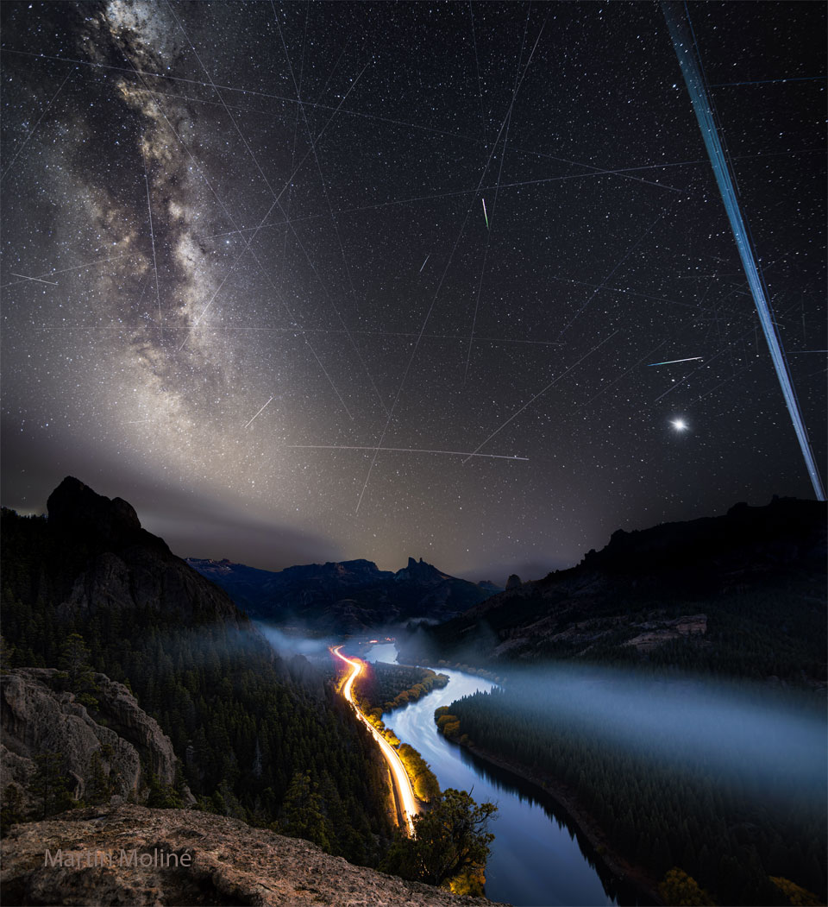

# Meteors-and-Satellite-Trails-over-the-Limay-River

**Date:** 14-06-25  
**Media Type:** `image`  

---

### Explanation

> What are all those streaks in the sky? A galaxy, many satellite trails, and a few meteors.  First, far in the distance, the majestic band of our Milky Way Galaxy runs down the left. Mirroring it on the right are several parallel trails of Earth-orbiting Starlink satellites. Many fainter satellite trails also crisscross the image. The two short and bright streaks are meteors — likely members of the annual Eta Aquariids meteor shower.  The planet Venus shines on the lower right.  Venus and the satellites shine by reflected sunlight. The featured picture is a composite of exposures all taken in a few hours on May 4 over the Limay River in Argentina.

---

[View this on NASA APOD](https://apod.nasa.gov/apod/astropix.html)
