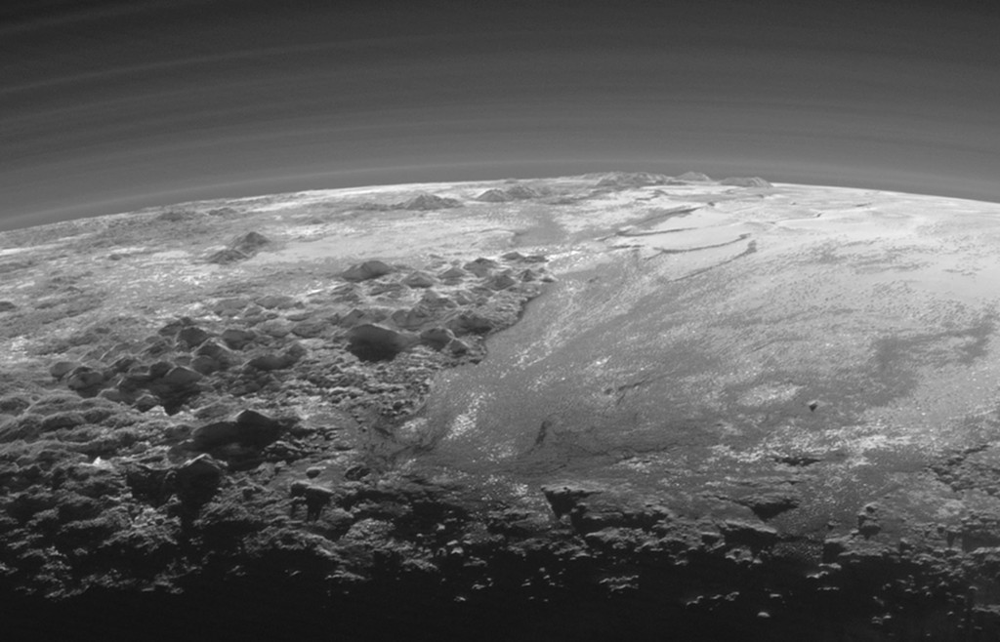

# A-Plutonian-Landscape

**Date:** 15-05-25  
**Media Type:** `image`  

---

### Explanation

> This shadowy landscape of majestic mountains and icy plains stretches toward the horizon on a small, distant world. It was captured from a range of about 18,000 kilometers when New Horizons looked back toward Pluto, 15 minutes after the spacecraft's closest approach on July 14, 2015. The dramatic, low-angle, near-twilight scene follows rugged mountains formally known as Norgay Montes from foreground left, and Hillary Montes along the horizon, giving way to smooth Sputnik Planum at right. Layers of Pluto's tenuous atmosphere are also revealed in the backlit view. With a strangely familiar appearance, the frigid terrain likely includes ices of nitrogen and carbon monoxide with water-ice mountains rising up to 3,500 meters (11,000 feet). That's comparable in height to the majestic mountains of planet Earth. The Plutonian landscape is 380 kilometers (230 miles) across.

---

[View this on NASA APOD](https://apod.nasa.gov/apod/astropix.html)
