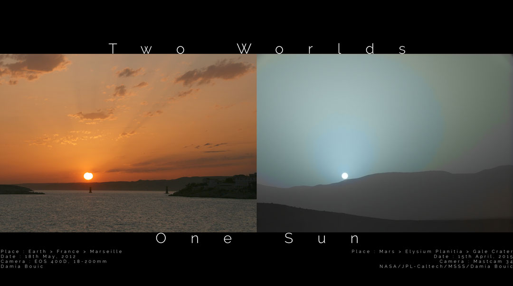

# Two-Worlds-One-Sun

**Date:** 15-06-25  
**Media Type:** `image`  

---

### Explanation

> How different does sunset appear from Mars than from Earth? For comparison, two images of our common star were taken at sunset, one from Earth and one from Mars. These images were scaled to have the same angular width and are featured here side-by-side. A quick inspection will reveal that the Sun appears slightly smaller from Mars than from Earth. This makes sense since Mars is 50% further from the Sun than Earth. More striking, perhaps, is that the Martian sunset is noticeably bluer near the Sun than the typically orange colors near the setting Sun from Earth. The reason for the blue hues from Mars is not fully understood, but thought to be related to forward scattering properties of Martian dust. The terrestrial sunset was taken in 2012 March from Marseille, France, while the Martian sunset was captured in 2015 by NASA's robotic Curiosity rover from Gale crater on Mars.   APOD Turns 30!: Free Public Lecture in Cork, Ireland on June 24

---

[View this on NASA APOD](https://apod.nasa.gov/apod/astropix.html)
