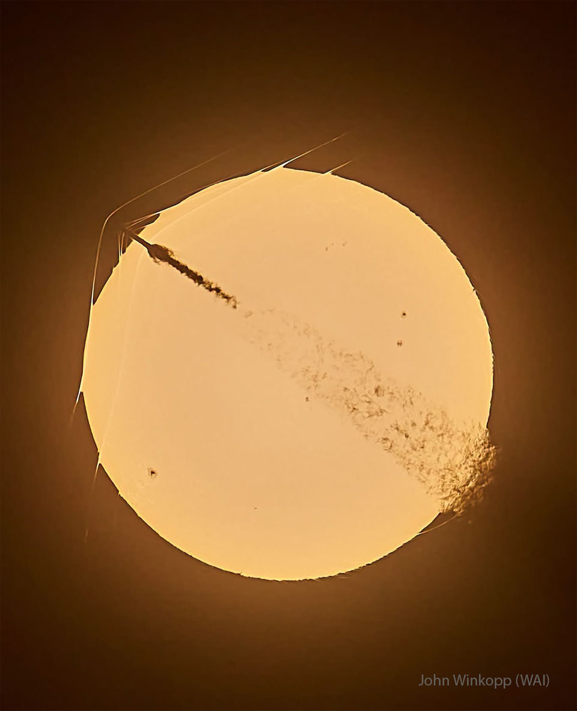

# Triple-Shockwave-from-Sun-Crossing-Rocket

**Date:** 15-06-26  
**Media Type:** `image`  

---

### Explanation

> What's happening to this Sun-crossing rocket?  The SpaceX Falcon 9 rocket, visible on the upper left, launched only about one minute before this amazing image was captured.  As it rose to low Earth orbit from Cape Canaveral, Florida, USA,  in late May, the rocket became supersonic before it crossed the disk of the distant Sun -- from the perspective of the well-placed photographer.  The spacecraft's high speed caused bow-shaped compressed-air shockwaves to form across leading surfaces, with at least three visible even outside the Sun's disk because they refract sunlight.  The trailing exhaust caused turbulence visible on the lower right. None of this was damaging to the robotic Starlink 10-53 mission, which delivered 29 communications satellites to low Earth orbit as planned.  And if that isn't amazing enough - the Sun had spots!    Sky Surprise: What picture did APOD feature on your birthday? (after 1995)

---

[View this on NASA APOD](https://apod.nasa.gov/apod/astropix.html)
