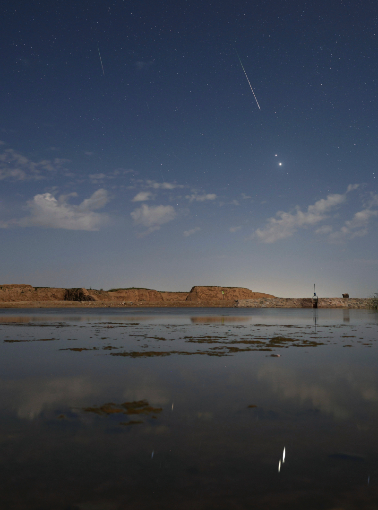

# Moonlight-Planets-and-Perseids

**Date:** 15-08-25  
**Media Type:** `image`  

---

### Explanation

> In the predawn sky on August 13, two planets were close. And despite the glare of a waning gibbous Moon, bright Jupiter and even brighter Venus were hard to miss. Their brilliant close conjunction is posing above the eastern horizon in this early morning skyscape. The scene was captured in a single exposure from a site near Gansu, China, with light from both planets reflected in the still waters of a local pond. Also seen against the moonlight were flashes from the annual Perseid Meteor Shower, known for its bright, fast meteors. Near the much anticipated peak of activity, the shower meteors briefly combined with the two planets for a celestial spectacle even in moonlit skies.

---

[View this on NASA APOD](https://apod.nasa.gov/apod/astropix.html)
