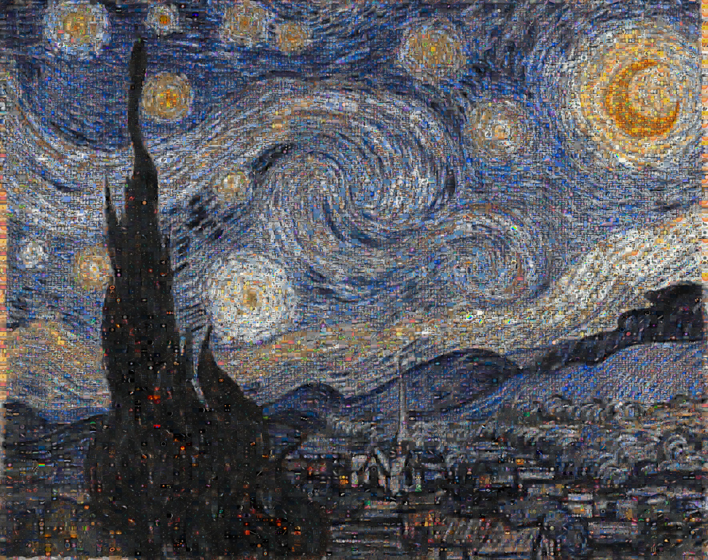

# APOD-is-30-Years-Old-Today

**Date:** 16-06-25  
**Media Type:** `image`  

---

### Explanation

> APOD is 30 years old today. In celebration, today's picture uses past APODs as tiles arranged to create a single pixelated image that might remind you of one of the most well-known and evocative depictions of planet Earth's night sky. In fact, this Starry Night consists of 1,836 individual images contributed to APOD over the last 5 years in a mosaic of 32,232 tiles. Today, APOD would like to offer a sincere thank you to our contributors, volunteers, and readers. Over the last 30 years your continuing efforts have allowed us to enjoy, inspire, and share a discovery of the cosmos.

---

[View this on NASA APOD](https://apod.nasa.gov/apod/astropix.html)
