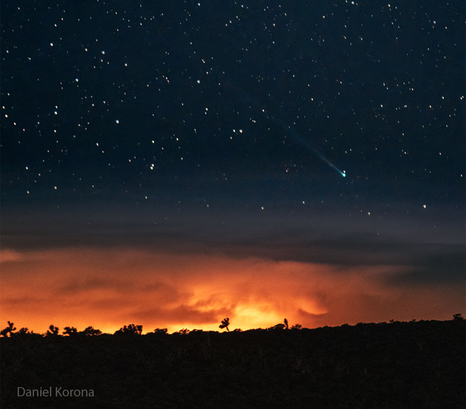

# New-Comet-SWAN25B-over-Mexico

**Date:** 16-09-25  
**Media Type:** `image`  

---

### Explanation

> A newly discovered comet is already visible with binoculars. The comet, C/2025 R2 (SWAN) and nicknamed SWAN25B, is brightening significantly as it emerges from the Sun's direction and might soon become visible on your smartphone -- if not your eyes. Although the brightnesses of comets are notoriously hard to predict, many comets appear brighter as they approach the Earth, with SWAN25B reaching only a quarter of the Earth-Sun distance near October 19.  Nighttime skygazers will also be watching for a SWAN25B-spawned meteor shower around October 5 when our Earth passes through the plane of the comet's orbit. The unexpectedly bright comet was discovered by an amateur astronomer in images of the SWAN instrument on NASA's SOHO satellite.  The comet is currently best observed in southern skies but is slowly moving north.  The featured image was captured at sunset three days ago just above the western horizon in Zacatecas, Mexico.

---

[View this on NASA APOD](https://apod.nasa.gov/apod/astropix.html)
