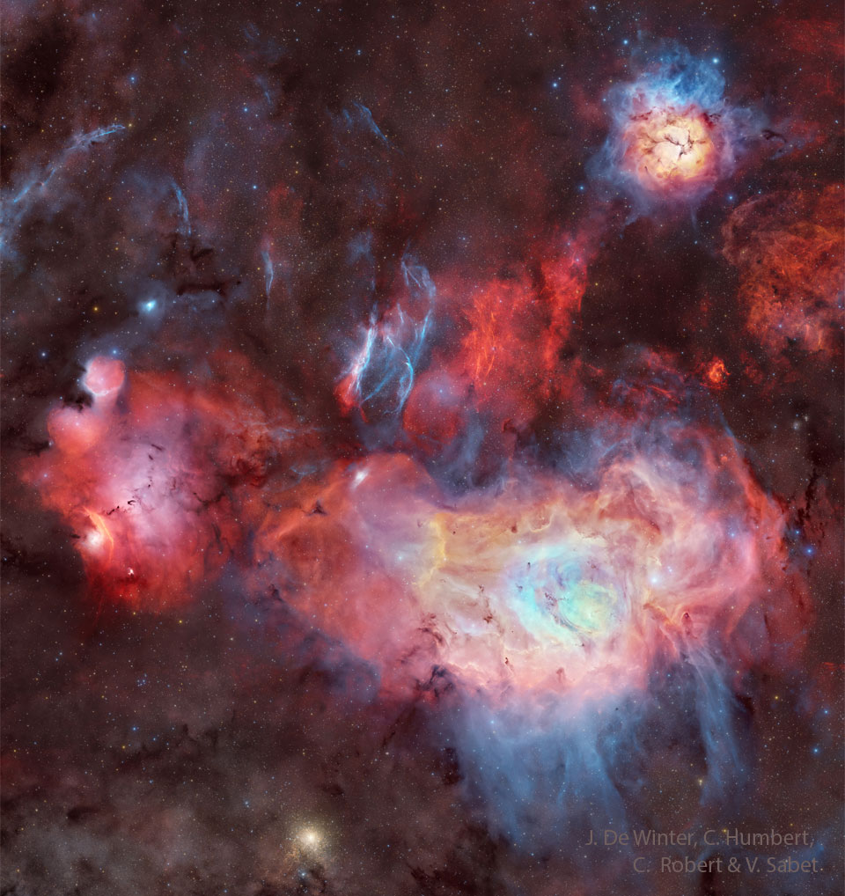

# Nebulas-and-Clusters-in-Sagittarius

**Date:** 17-09-25  
**Media Type:** `image`  

---

### Explanation

> Can you spot famous celestial objects in this image?  18th-century astronomer Charles Messier cataloged only two of them: the bright Lagoon Nebula (M8) at the bottom, and the colorful Trifid Nebula (M20) at the upper right.  The one on the left that resembles a cat's paw is NGC 6559, and it is much fainter than the other two.  Even harder to spot are the thin blue filaments on the left, from supernova remnant (SNR G007.5-01.7).  Their glow comes from small amounts of glowing oxygen atoms that are so faint that it took over 17 hours of exposure with just one blue color to bring up. Framing this scene of stellar birth and death are two star clusters: the open cluster M21 just above Trifid, and the globular cluster NGC 6544 at lower left.

---

[View this on NASA APOD](https://apod.nasa.gov/apod/astropix.html)
