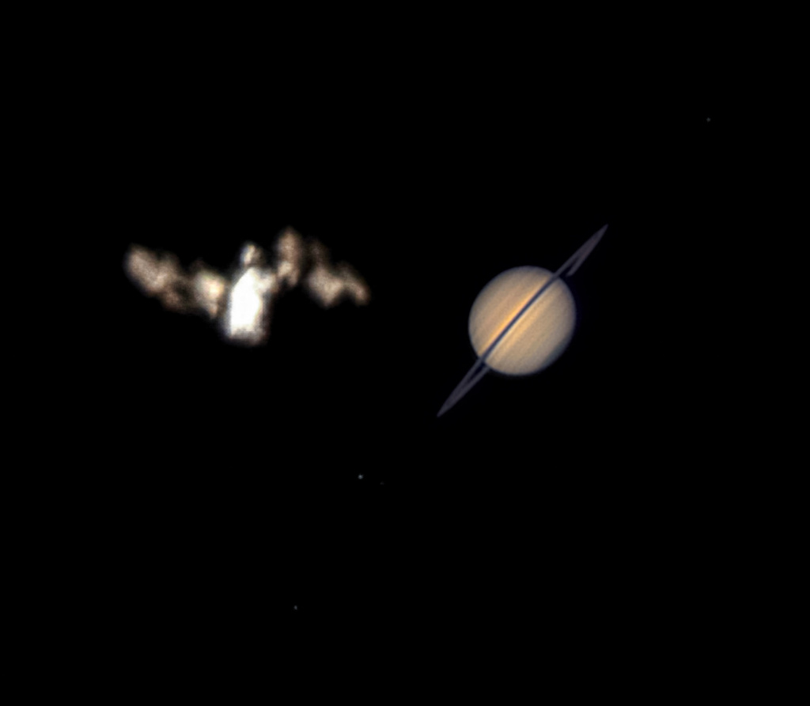

# ISS-Meets-Saturn

**Date:** 18-07-25  
**Media Type:** `image`  

---

### Explanation

> This month, bright planet Saturn rises in evening skies, its rings oriented nearly edge-on when viewed from planet Earth. And in the early morning hours on July 6, it posed very briefly with the International Space Station when viewed from a location in Federal Way, Washington, USA. This well-planned image, a stack of video frames, captures their momentary conjunction in the same telescopic field of view. With the ISS in low Earth orbit, space station and gas giant planet were separated by almost 1.4 billion kilometers. Their apparent sizes are comparable but the ISS was much brighter than Saturn and the ringed planet's brightness has been increased for visibility in the stacked image. Precise timing and an exact location were needed to capture the ISS/Saturn conjunction.

---

[View this on NASA APOD](https://apod.nasa.gov/apod/astropix.html)
