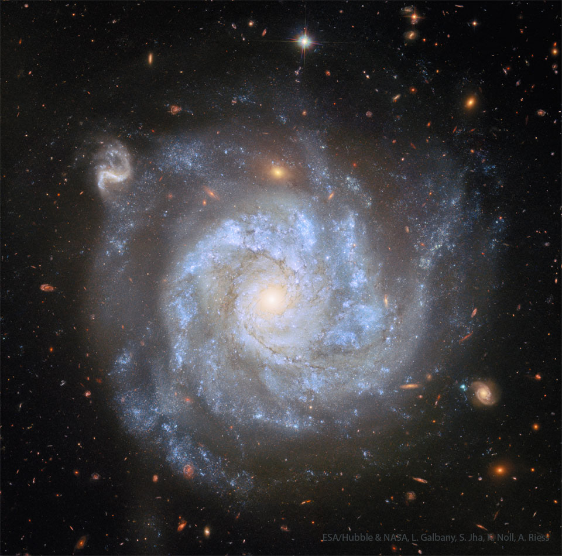

# NGC-1309-A-Useful-Spiral-Galaxy

**Date:** 18-08-25  
**Media Type:** `image`  

---

### Explanation

> This galaxy is not only pretty -- it's useful.  A gorgeous spiral some 100 million light-years distant, NGC 1309 lies on the banks of the constellation of the River (Eridanus). NGC 1309 spans about 30,000 light-years, making it about one third the size of our larger Milky Way galaxy. Bluish clusters of young stars and dust lanes are seen to trace out NGC 1309's spiral arms as they wind around an older yellowish star population at its core. Not just another pretty face-on spiral galaxy, observations of NGC 1309's two recent supernovas and multiple  Cepheid variable stars contribute to the calibration of the expansion of the Universe. Still, after you get over this beautiful galaxy's grand design, check out the array of more distant background galaxies also recorded in this sharp image from the  Hubble Space Telescope.

---

[View this on NASA APOD](https://apod.nasa.gov/apod/astropix.html)
