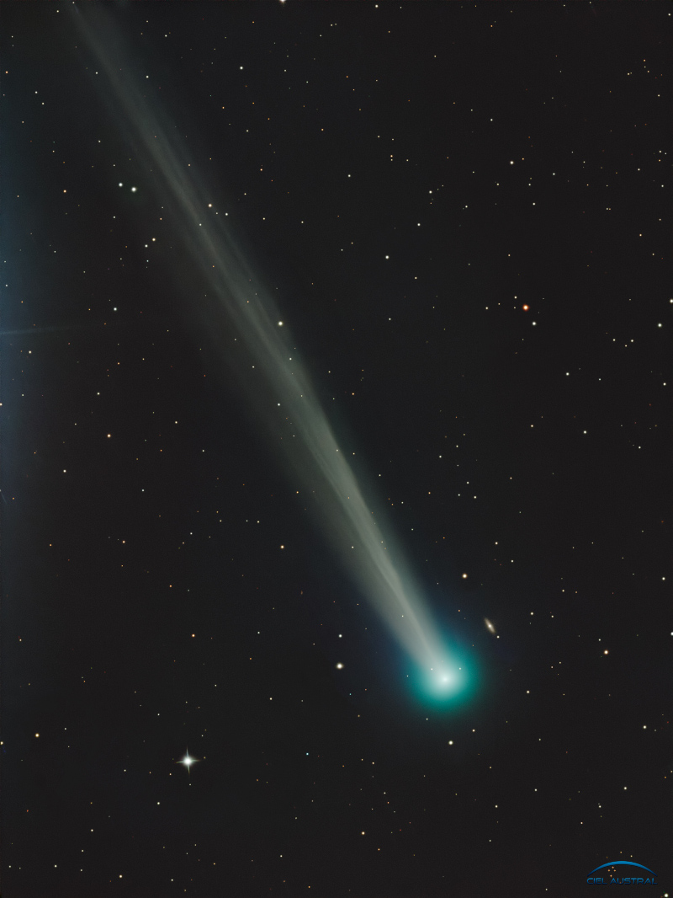

# Comet-C2025-R2-SWAN

**Date:** 18-09-25  
**Media Type:** `image`  

---

### Explanation

> A new visitor from the outer Solar System, comet C/2025 R2 (SWAN) also known as SWAN25B was only discovered late last week, on September 11. That's just day before the comet reached perihelion, its closest approach to the Sun. First spotted by Vladimir Bezugly in images from the SWAN instrument on the sun-staring SOHO spacecraft, the comet was surprisingly bright but understandably difficult to see against the Sun's glare. Still close to the Sun on the sky, the greenish coma and tail of C/2025 R2 (SWAN) are captured in this telescopic snapshot from September 17. Spica, alpha star of the constellation Virgo, shines just beyond the upper left edge of the frame while the comet is about 6.5 light-minutes from planet Earth. Near the western horizon after sunset and slightly easier to see in binoculars from the southern hemisphere, this comet SWAN will pass near Zubenelgenubi, alpha star of Libra, on October 2.  C/2025 R2 (SWAN) is scheduled to make its closest approach to our fair planet around October 20.

---

[View this on NASA APOD](https://apod.nasa.gov/apod/astropix.html)
