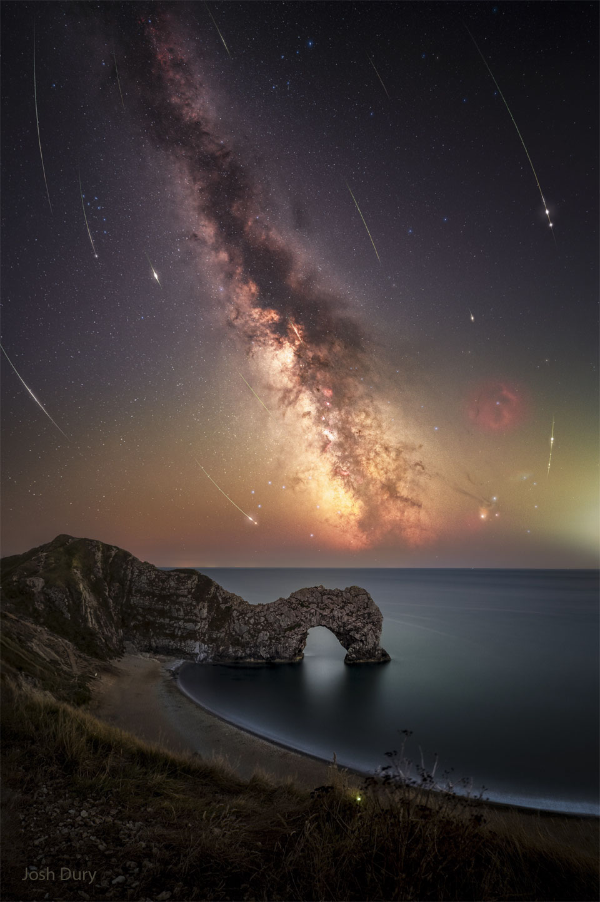

# Perseid-Meteors-from-Durdle-Door

**Date:** 20-08-25  
**Media Type:** `image`  

---

### Explanation

> What are those curved arcs in the sky? Meteors -- specifically, meteors from this year's Perseid meteor shower.  Over the past few weeks, after the sky darkened, many images of Perseid meteors were captured separately and merged into a single frame, taken earlier.  Although the meteors all traveled on straight paths, these paths appear slightly curved by the wide-angle lens of the capturing camera.  The meteor streaks can all be traced back to a single point on the sky called the radiant, here just off the top of the frame in the constellation of Perseus. The same camera took a deep image of the background sky that brought up the central band of our Milky Way galaxy running nearly vertically through the featured image's center. The limestone arch in the foreground in Dorset, England is known as Durdle Door, a name thought to survive from a thousand years ago.

---

[View this on NASA APOD](https://apod.nasa.gov/apod/astropix.html)
