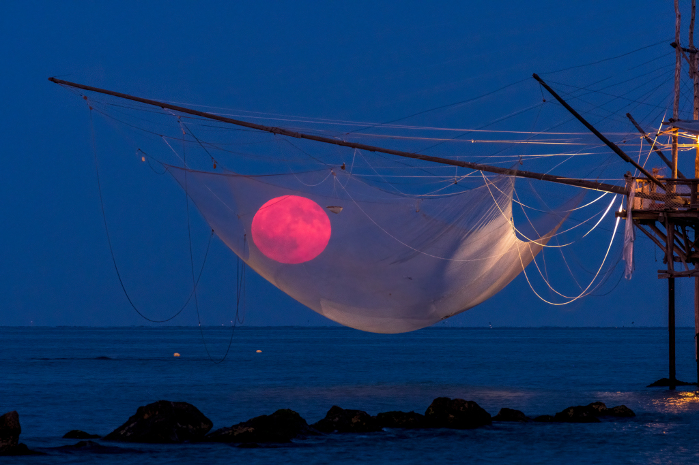

# Fishing-for-the-Moon

**Date:** 23-08-25  
**Media Type:** `image`  

---

### Explanation

> How big is planet Earth's Moon? Compared to other moons of the Solar System, it's number 5 on the largest to smallest ranked list, following Jupiter's moon Ganymede, Saturn's moon Titan, and Jovian moons Callisto and Io. Continuing the list, the Moon comes before Jupiter's Europa and Neptune's Triton. It's also larger than dwarf planets Pluto and Eris. With a diameter of 3,475 kilometers the Moon is about 1/4 the size of Earth though, and that does make it the largest moon when compared to the size of its parent Solar System planet. Of course in this serene, twilight sea and skyscape, August's rising Full Moon still appears small enough to be caught in the nets of an ancient fishing rig. The telephoto snapshot was taken along the Italian Costa dei Trabocchi, on the Adriatic Sea.

---

[View this on NASA APOD](https://apod.nasa.gov/apod/astropix.html)
