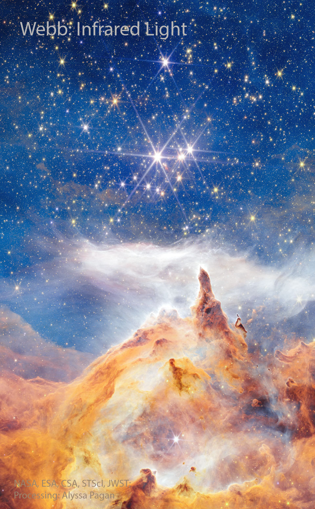

# Astronomy-Picture-of-the-Day

**Date:** 23-09-25  
**Media Type:** `image`  

---

### Explanation

> How massive can a normal star be?  Estimates made from distance, brightness and standard solar models had given one star in the open cluster Pismis 24 over  200 times the mass of our Sun, making it one of the most massive stars known.  This star is the brightest object located in the central cavity near the bottom center of the featured image taken with the Webb Space Telescope in infrared light.  For comparison, a rollover image from the Hubble Space Telescope  is also featured in visible light. Close inspection of the images,  however, has shown that Pismis 24-1 derives its brilliant luminosity not from a single star but from three at least.  Component stars would still remain near 100 solar masses, making them among the more massive stars currently on record.  Toward the bottom of the image, stars are still forming in the associated emission nebula NGC 6357. Appearing perhaps like

---

[View this on NASA APOD](https://apod.nasa.gov/apod/astropix.html)
