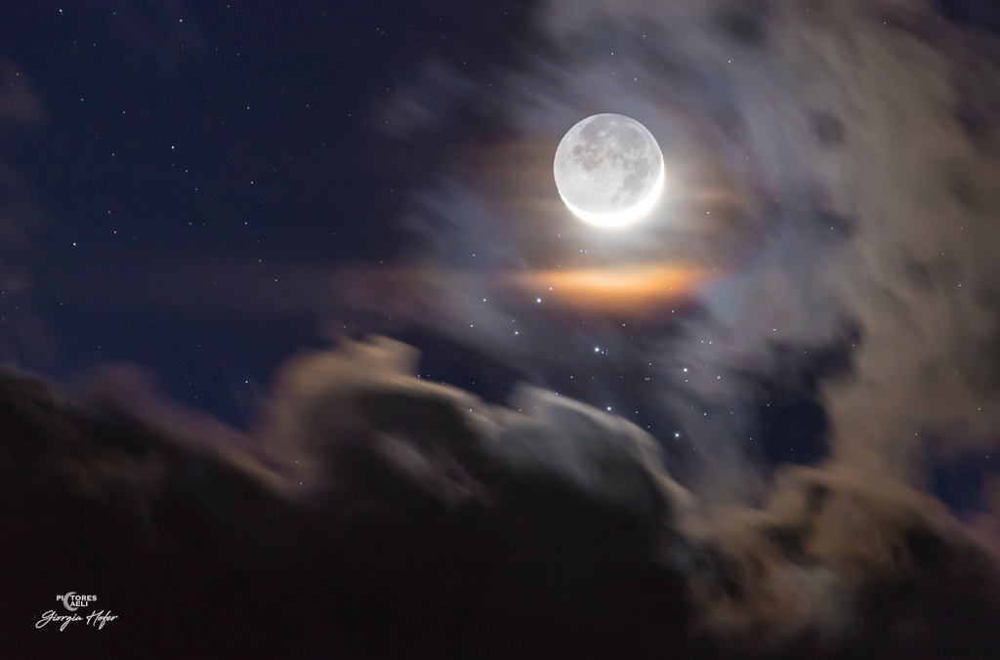

# Young-Moon-and-Sister-Stars

**Date:** 24-04-26  
**Media Type:** `image`  

---

### Explanation

> Sunlit arms of a crescent moon seem to embrace the faint lunar night side in this dramatic celestial scene from planet Earth. The single telephoto exposure tracking the sky was captured on the night of April 19, when a two day old Moon was near perigee in its elliptical orbit. On that date, the young Moon was also close on the sky to the lovely Pleiades Star Cluster. With the moonlight dimmed by clouds the Pleiades sister stars gather below the Moon's bright crescent, seen through a faint but colorful lunar corona. The lunar night side is illuminated by earthshine, sunlight reflected from the Earth itself. The Moon's ashen glow, also known as the "old moon in the young moon's arms", tends to be brighter in the northern hemisphere spring. And for now, the Moon's orbit takes it near the Pleiades stars each month in planet Earth's sky, though their close conjunctions are easiest to see when the Moon is near a crescent phase.

---

[View this on NASA APOD](https://apod.nasa.gov/apod/astropix.html)
