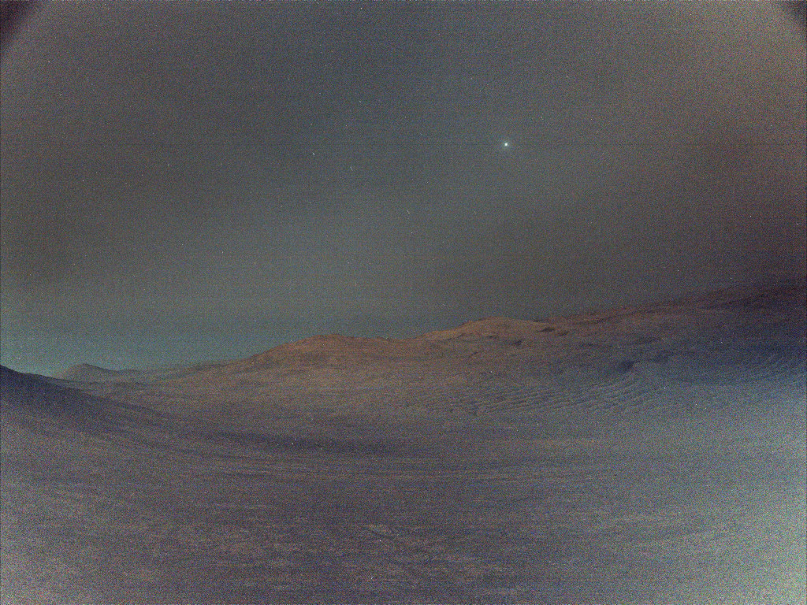

# Deimos-Before-Sunrise

**Date:** 24-05-25  
**Media Type:** `image`  

---

### Explanation

> Deimos takes 30 hours and 18 minutes to complete one orbit around the Red Planet. That's a little more than one Martian day or sol which is about 24 hours and 40 minutes long, so Deimos drifts westward across the Martian sky. About 15 kilometers across at its widest, the smallest of Mars' two moons is bright though. In fact Deimos is the brightest celestial object in this Martian skyscape captured before sunrise by Perseverance on March 1, the 1,433rd sol of the Mars rover's mission. The image is a composed of 16 exposures recorded by one of the rover's navigation cameras. The individual exposures were combined into a single image for an enhanced low light view. Regulus and Algeiba, bright stars in the constellation Leo, are also visible in the dark Martian predawn sky.

---

[View this on NASA APOD](https://apod.nasa.gov/apod/astropix.html)
