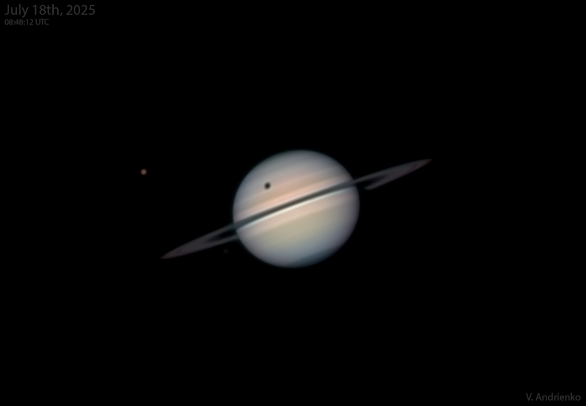

# Titan-Shadow-Transit

**Date:** 24-07-25  
**Media Type:** `image`  

---

### Explanation

> very 15 years or so, Saturn's rings are tilted edge-on to our line of sight. As the bright, beautiful ring system grows narrower and fainter it becomes increasingly difficult to see for denizens of planet Earth. But it does provide the opportunity to watch transits of Saturn's moons and their dark shadows across the ringed gas giant's still bright disk. Of course Saturn's largest moon Titan is the easiest to spot in transit. In this telescopic snapshot from July 18, Titan itself is at the upper left, casting a round dark shadow on Saturn's banded cloudtops above the narrow rings. In fact Titan's transit season is in full swing now with shadow transits every 16 days corresponding to the moon's orbital period. Its final shadow transit will be on October 6, though Titan's pale disk will continue to cross in front of Saturn as seen from telescopes on planet Earth every 16 days through January 25, 2026.

---

[View this on NASA APOD](https://apod.nasa.gov/apod/astropix.html)
