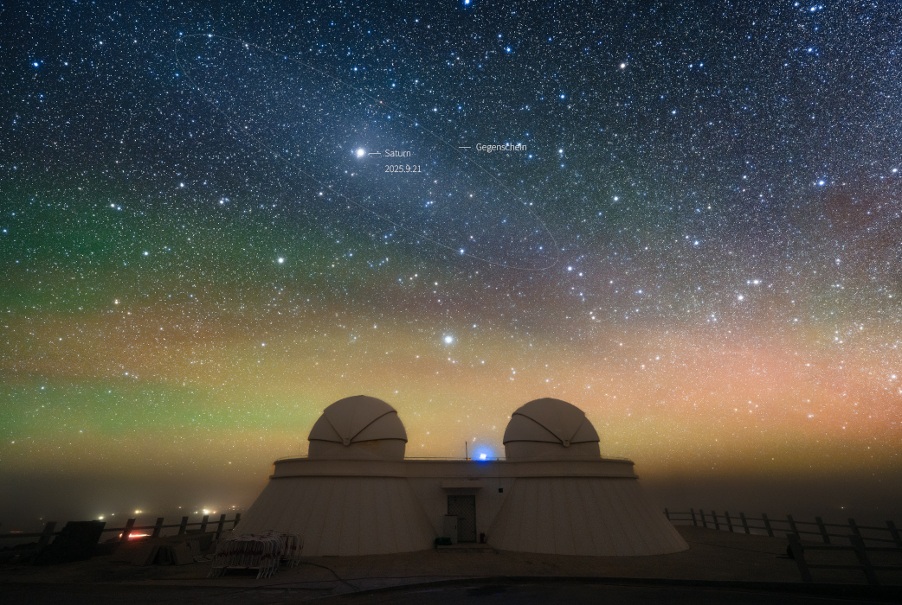

# Saturn-Opposite-the-Sun

**Date:** 25-09-25  
**Media Type:** `image`  

---

### Explanation

> This year Saturn was at opposition on September 21, opposite the Sun in planet Earth's sky. At its closest to Earth, Saturn was also at its brightest of the year, rising as the Sun set and shining above the horizon all night long among the fainter stars of the constellation Pisces. In this snapshot from the Qinghai Lenghu Observatory, Tibetan Plateau, southwestern China, the outer planet is immersed in a faint, diffuse oval of light known as the gegenschein or counter glow. The diffuse gegenschein is produced by sunlight backscattered by interplanetary dust along the Solar System's ecliptic plane, opposite the Sun in planet Earth's sky. Like a giant eye, on this dark night Saturn and gegenschein seem to stare down on the observatory's telescope domes seen against a colorful background of airglow along the horizon.

---

[View this on NASA APOD](https://apod.nasa.gov/apod/astropix.html)
