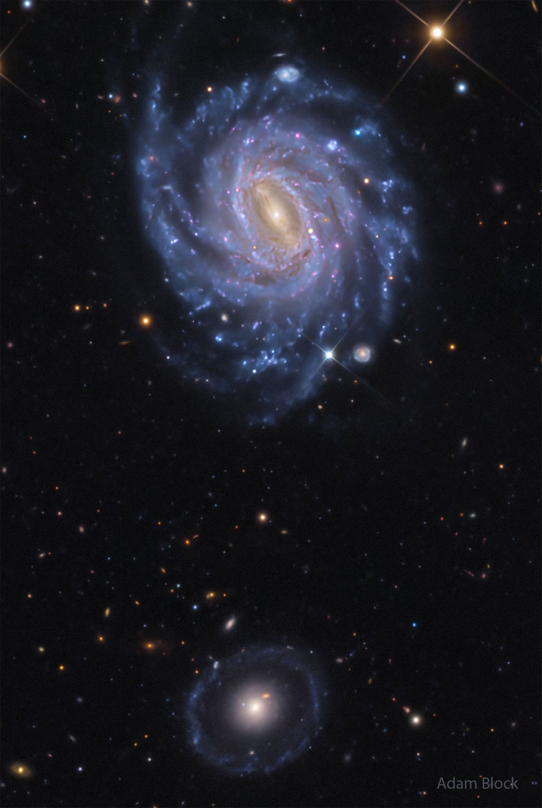

# NGC-3660-and-Burçins-Galaxy

**Date:** 26-05-26  
**Media Type:** `image`  

---

### Explanation

> The upper galaxy might be more photogenic, but the lower galaxy is more unusual.  The galaxy up top is NGC 3660, a spiral galaxy similar to our own Milky Way galaxy in that it has several bright blue spiral arms and a central bar of stars, dust, and gas. Captured by chance in the featured deep and colorful image, surprisingly, is SN 2026cff, a supernova found just to the right of the central bar.  Farther in the distance is the bottom galaxy, known informally as Burçin’s galaxy, but formally cataloged as LEDA 1000714. The center of this galaxy appears to be an old elliptical galaxy, but it is strangely surrounded by not one but two rings of stars.  What created Burçin's galaxy is a mystery and remains a continuing topic of research, but it likely involves the accretion of one or more smaller galaxies.

---

[View this on NASA APOD](https://apod.nasa.gov/apod/astropix.html)
