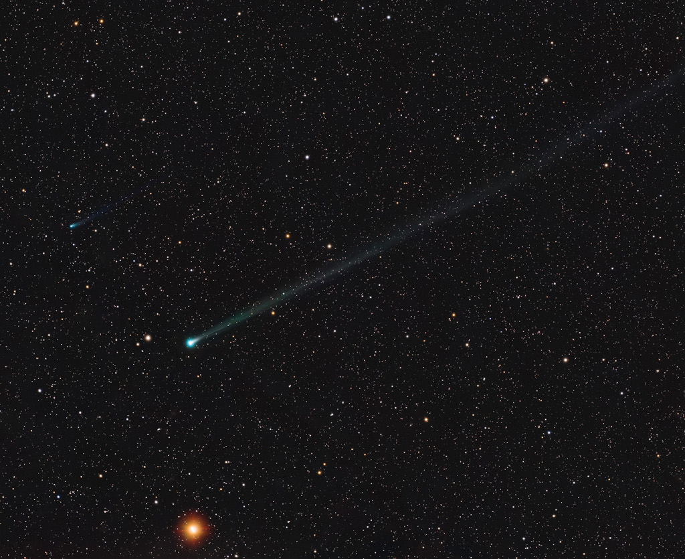

# A-SWAN-an-ATLAS-and-Mars

**Date:** 26-09-25  
**Media Type:** `image`  

---

### Explanation

> A new visitor to the inner Solar System, comet C/2025 R2 (SWAN) sports a long ion tail extending diagonally across this almost 7 degree wide telescopic field of view recorded on September 21. A fainter fellow comet also making its inner Solar System debut, C/2025 K1 (ATLAS), can be spotted above and left of SWAN's greenish coma, just visible against the background sea of stars in the constellation Virgo. Both new comets were only discovered in 2025 and are joined in this celestial frame by ruddy planet Mars (bottom), a more familiar wanderer in planet Earth's night skies. The comets may appear to be in a race, nearly neck and neck in their voyage through the inner Solar System and around the Sun. But this comet SWAN has already reached its perihelion or closest approach to the Sun on September 12 and is now outbound along its orbit. This comet ATLAS is still inbound though, and will make its perihelion passage on October 8.

---

[View this on NASA APOD](https://apod.nasa.gov/apod/astropix.html)
