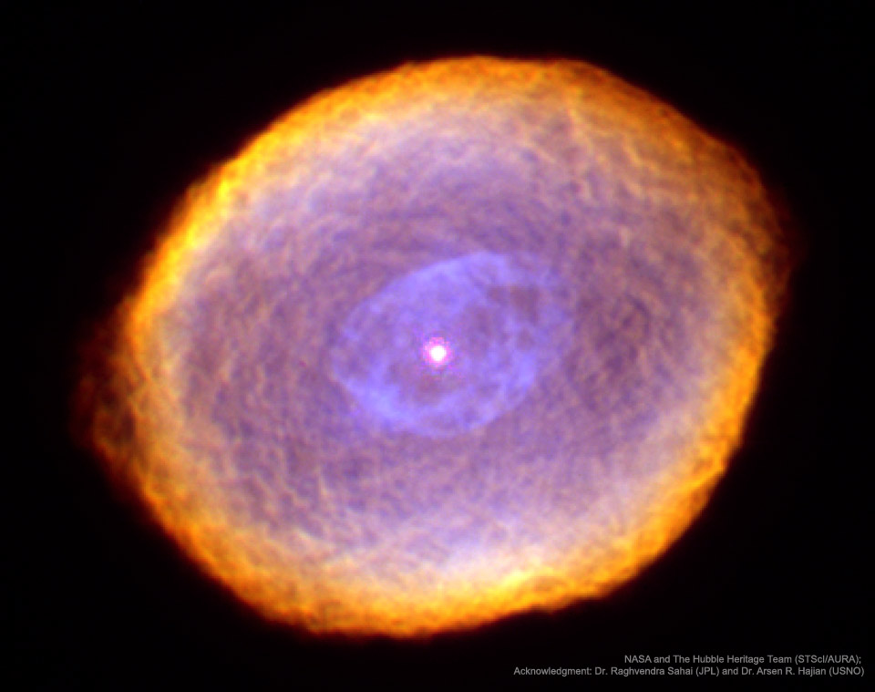

# IC-418-The-Spirograph-Nebula

**Date:** 27-04-25  
**Media Type:** `image`  

---

### Explanation

> What is creating the strange texture of IC 418?  Dubbed the Spirograph Nebula for its resemblance to drawings from a cyclical drawing tool, planetary nebula IC 418 shows patterns that are not well understood. Perhaps they are related to chaotic winds from the variable central star, which changes brightness unpredictably in just a few hours.  By contrast, evidence indicates that only a few million years ago, IC 418 was probably a well-understood star similar to our Sun.  Only a few thousand years ago, IC 418 was probably a common red giant star.  Since running out of nuclear fuel, though, the outer envelope has begun expanding outward leaving a hot remnant core destined to become a white-dwarf star, visible in the image center. The light from the central core excites surrounding atoms in the nebula causing them to glow. IC 418 lies about 2000 light-years away and spans 0.3 light-years across.  This false-color image taken from the Hubble Space Telescope reveals the unusual details.

---

[View this on NASA APOD](https://apod.nasa.gov/apod/astropix.html)
