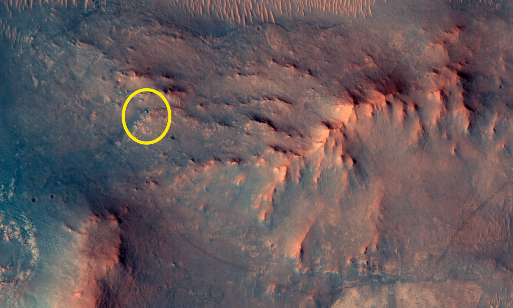

# Mars-Marathon-by-Perseverance

**Date:** 27-06-26  
**Media Type:** `image`  

---

### Explanation

> In this recent HiRISE view from the Mars Reconnaissance Orbiter, the little green dot indicated on the surface of the big Red Planet is the Perseverance Mars rover. Recorded on June 13, the car-sized, six-wheeled robot was imaged a day before completing a Martian marathon, traveling a total distance of 26.218 miles (42.195 kilometers) since it began exploring the surface of Mars. That equivalent marathon distance was achieved by Perseverance on its mission sol (Martian day) 1,890, after about 5 Earth years and 4 Earth months of driving. Perseverance is continuing to hunt for biosignatures. In the HiRISE image, the Mars rover's tracks can be seen leading to its location in an area west of its landing site in Jezero crater near an ancient river delta.

---

[View this on NASA APOD](https://apod.nasa.gov/apod/astropix.html)
