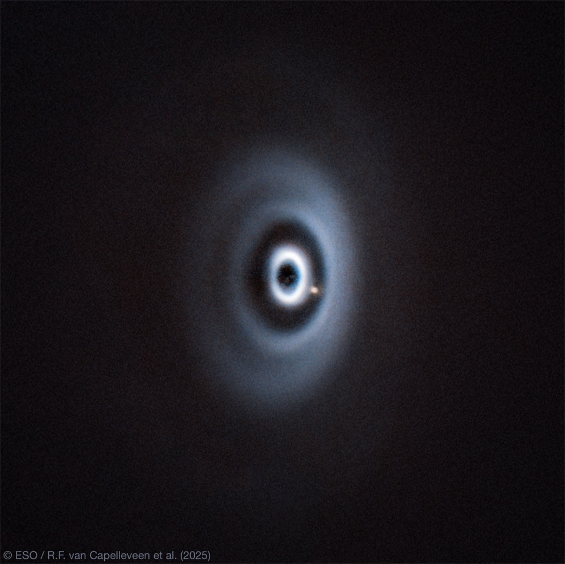

# WISPIT-2b-Exoplanet-Carves-Gap-in-Birth-Disk

**Date:** 27-08-25  
**Media Type:** `image`  

---

### Explanation

> That yellow spot -- what is it? It's a young planet outside our Solar System. The featured image from the Very Large Telescope in Chile surprisingly captures a distant scene much like our own Solar System's birth, some 4.5 billion years ago.  Although we can't look into the past and see Earth's formation directly, telescopes let us watch similar processes unfolding around distant stars.  At the center of this frame lies a young Sun-like star, hidden behind a coronagraph that blocks its bright glare.  Surrounding the star is a bright, dusty protoplanetary disk -- the raw material of planets.  Gaps and concentric rings mark where a newborn world is gathering gas and dust under its gravity, clearing the way as it orbits the star.  Although astronomers have imaged disk-embedded planets before, this is the first-ever observation of an exoplanet actively carving a gap within a disk -- the earliest direct glimpse of planetary sculpting in action.

---

[View this on NASA APOD](https://apod.nasa.gov/apod/astropix.html)
