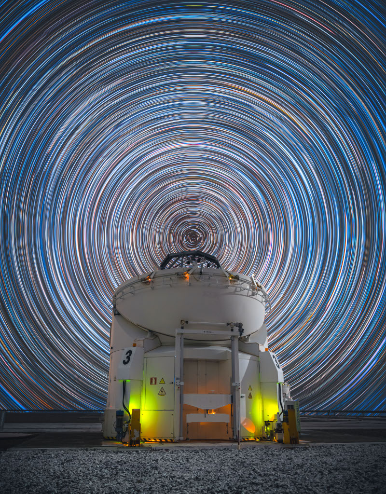

# The-Sky-Turns-Above-Paranal

**Date:** 28-08-26  
**Media Type:** `image`  

---

### Explanation

> At the latitude of ESO's Paranal Observatory in Chile, about 25 degrees south, Earth's rotation moves the planet's surface eastward at over 1,500 kilometers per hour. And while that's faster than the speed of sound at sea level, the motion is imperceptible. Still, that motion can be revealed in the apparent rotation of the night sky by photographing star trails. This star trail image was composed from a digital stack of 300 consecutive 25-second exposures made with a camera fixed to a tripod to trace the star trail arcs. The graceful arcs are concentric and centered at the south celestial pole, the southern hemisphere extension of Earth's axis of rotation into space. One of the observatory's operating 1.8 meter auxiliary telescopes, AT 3, appears beneath the south celestial pole, faintly illuminated in the foreground of this well-planned scene from a rotating planet.  APOD's main NASA site is moving: From apod.nasa.gov to science.nasa.gov/apod

---

[View this on NASA APOD](https://apod.nasa.gov/apod/astropix.html)
