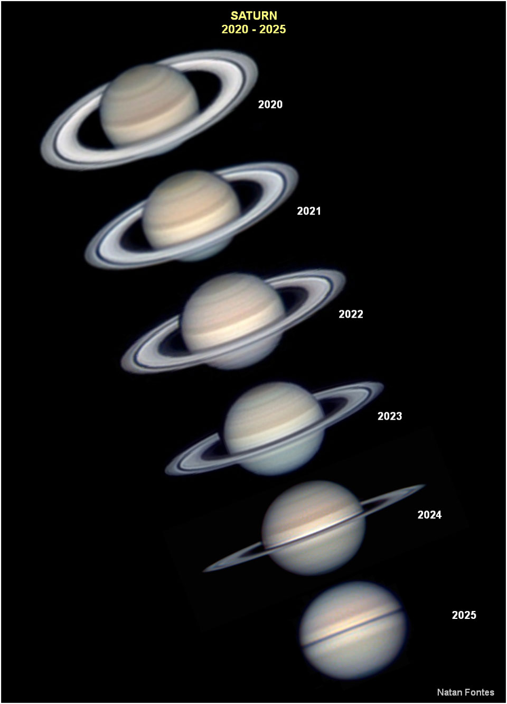

# Saturns-Rings-Appear-to-Disappear

**Date:** 29-04-25  
**Media Type:** `image`  

---

### Explanation

> Where are Saturn's ears? Galileo is credited, in 1610, as the first person to see Saturn's rings. Testing out Lipperhey's recently co-invented telescope, Galileo did not know what they were and so called them "ears".  The mystery deepened in 1612, when Saturn's ears mysteriously disappeared. Today we know exactly what happened: from the perspective of the Earth, Saturn's rings had become too thin to see.  The same drama plays out every 15 years because Saturn, like Earth, undergoes tilt-driven seasons. This means that as Saturn goes around the Sun, its equator and rings can tilt noticeably toward the Sun and inner Solar System, making them easily visible, but from other orbital locations will appear almost not at all.  The featured picture from Brasilia, Brazil shows a modern version of this sequence: the top ring-dominated image was taken in 2020, while the bottom ring-obscure image taken earlier in 2025.   Make Saturn's Rings Musical: Play them like a harp!

---

[View this on NASA APOD](https://apod.nasa.gov/apod/astropix.html)
