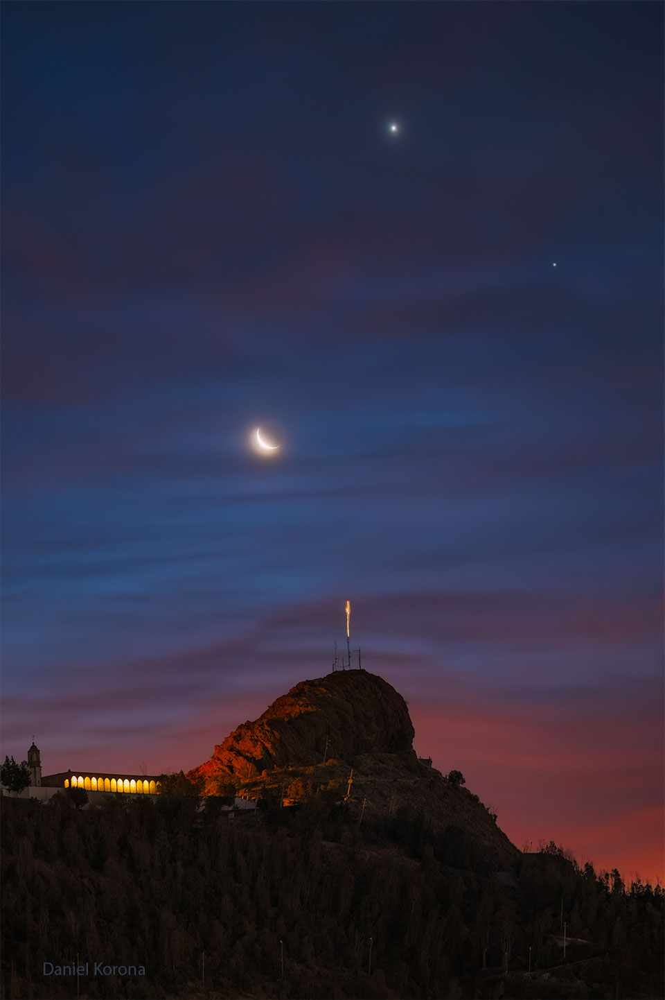

# A-Happy-Sky-over-Bufa-Hill-in-Mexico

**Date:** 30-04-25  
**Media Type:** `image`  

---

### Explanation

> Sometimes, the sky itself seems to smile.  A few days ago, visible over much of the world, an unusual superposition of our Moon with the planets Venus and Saturn created just such an iconic facial expression. Specifically, a crescent Moon appeared to make a happy face on the night sky when paired with seemingly nearby planets.  Pictured is the scene as it appeared over Zacatecas, México, with distinctive Bufa Hill in the foreground.  On the far right and farthest in the distance is the planet Saturn.  Significantly closer and visible to Saturn's upper left is Venus, the brightest planet on the sky.  Just above the central horizon is Earth's Moon in a waning crescent phase. To create this gigantic icon, the crescent moon phase must be smiling in the correct direction.   Dial-A-Moon: Find the Moon phase on your birthday this year

---

[View this on NASA APOD](https://apod.nasa.gov/apod/astropix.html)
